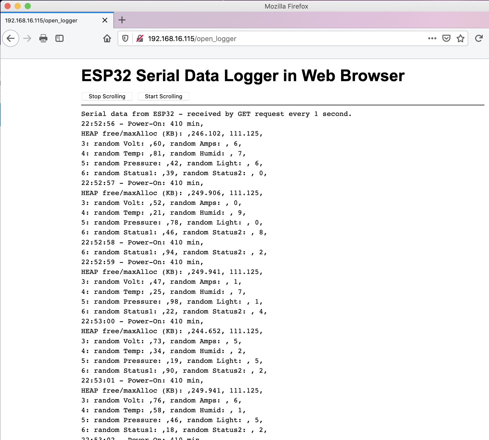
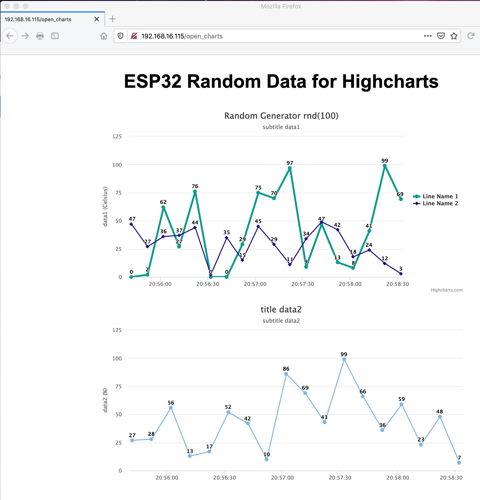

# Automatic long-term logging for remote ESP32 IoT devices, by the Web Browser or an CURL script

read time: 30 min / understand time: 1 hour / test-it-out time: 2 hours

This project will tell you a story you may already know well: after many days of developing an IoT device and spending also some nights to test it in your workroom, you finally install it in the target location.
Then, after many days of bugless work, you surprisingly encounter some wrong results in the IoT data.
Such errors can occure seldomly and are hard to debug, out there in the real world environment ... so you need a remote logger for your ESP32!

For me, it was a Solar-Power Meter, built with ESP32 and INA219 and WiFi, installed under the roof, to measure the Solar current/voltage and sending it to ThinSpeak cloud.
After some weeks, the data sent to the ThingSpeak cloud suddenly showed a measure of the maximum solar power at midnight! That's impossible in Germany for sure, but what is the root cause for it? Is it something in the Solar Controller, some strange overvoltage, or a bug in my ESP32 IoT device? It happened circa twice a month, so and I wanted to fix it.

Known issue: the Arduino OTA feature can only send code to the remote ESP32, but does not connect the serial port over WiFi. There have been a couple of ideas to receive log entries from a remote ESP32 IoT device connected to WiFi on your Laptop or PC, just to mention two, which I do not find convenient enough: 
- implement Telnet on ESP32 and use PUTTY locally on your Laptop/PC to retrieve the serial log from the ESP,
- other solutions suggest to redirect the TX pin output of the standard Serial.Print() to a buffer which could be requested by a Web Browser,
 

After implementing my simple solution for long-term logging of data entries from an remote ESP32 IoT device (by using a Web Browser or the CURL script), I was surprised to see:
- in that seldom moments of wrong results, an I2C failure happened and the I2C-read from INA219 returned a totally wrong results (I also learned that Wire.requestFrom() does NOT return the number bytes correctly received, see source: https://github.com/arduino/ArduinoCore-avr/issues/171),
- additionally and totally unseen before, the ESP32 device did one reboot! Condition was, when the Thingspeak cloud was not reachable for a while (network issue or cloud outage) and the ThingSpeak library failed to upload it's data 8 times with Error -301, then exactly in the moment of that 8th attempt, the ESP32 did start to reboot.
 

## 1 - How the "Automatic long-term logging for remote ESP32 IoT devices" works
My suggested solution implemented the ideas of:
- keep the Serial.Print() for local debugging and for short-term logging only (by cable),
- use a new LogLinePrint() to write log-items especially made for long-term logging (as CSV if required),
- the new LogLinePrint() stores all log items into a buffer (and clears the buffer after send),
- add an handler in the ESP32 WebServer to send the log-line buffer after each GET requests from Browser,
- let the Web Browser automatically send a GET-request every second and let it append the log-lines on the screen,
- provide a CURL scirpt which requests the log-line buffer every second and writes them into files on your Laptop/PC or Raspi automatically and unsupervised,
- use the ESP32 SPIFFS to store the used HTML files and the CURL script (don't forget to upload the 'data folder' files together with your code in the Arduino IDE), 
- access all logging features by just opening the IP address in the Web Browser to open the main web page,
 

 

## 2 - Also, I added some Highcharts example code to implement a simple replacement of Arduino Serial-Plotter using WiFi:
- use Highcharts to visualize ESP32 data of slow changing values and mid-term logging in an Web Browser,
- Highcharts source: https://www.highcharts.com/demo
- the Highcharts script running in the HTML of the Web Browser requests data from the ESP32 every 10 seconds (can be configured in HTML file)
- the ESP32 added a handler in the WebServer to send the data after each GET requests back to the Browser script,
- a Highcharts mult-line graph needs multiple data compiled into a JSON object to be returned,
- access also the Highcharts logging features by just opening the IP address in the Web Browser,
 

 
